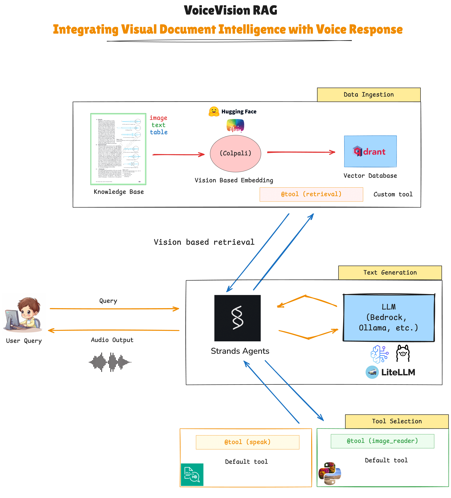

# Integrating Visual Document Intelligence with Voice Response with ColPali, Ollama and Phoenix

In this example, we demonstrate an **Agentic RAG (Retrieval-Augmented Generation) AI Tutor** that seamlessly combines custom and default tools with open-source toolkits for a multimodal, voice-enabled educational assistant. The core workflow is:

- **Data is embedded using a vision-based model from Hugging Face** (ColPali)
- **Embeddings are stored in Qdrant** (vector database)
- **The LLM is powered by Bedrock, Ollama, or GPT** (for reasoning and answer generation)
- **The final voice response is generated using Amazon Polly via a default tool**

At its core, this system uses:
- **Vision** → for retrieval (extracting relevant textbook images/pages)
- **Text** → for querying (user questions and LLM reasoning)
- **Voice** → for generation (spoken answers)

All components are orchestrated using the **Phoenix agentic framework**, enabling flexible, modular, and extensible agent workflows.



## Prerequisites

Ensure you have Conda installed on your machine to manage your environments and packages.

## Setup

1. **Create and activate a new `conda` environment**:
   ```bash
   conda create --name rag_env python=3.12
   conda activate rag_env
   ```

2. **Install dependencies**:
   ```bash
   pip install -r requirements.txt
   ```

3. **Install Jupyter support**:
   ```bash
   conda install ipykernel
   python -m ipykernel install --user --name=rag_env --display-name "Python (rag_env)"
   ```
4. **Create a new `.env` file and update the `HUGGING_FACE_TOKEN`**

## [Voice-based Agentic RAG: Multimodal Retrieval with Voice Response](Voice_based_AgenticRAG.ipynb)
This notebook demonstrates:
- **End-to-end workflow for building a voice-enabled, agentic RAG system** for textbook tutoring
- Ingesting and converting textbook PDFs to images
- Using `ColPali` for multimodal (text and image) embedding and retrieval
- Storing and searching embeddings in a `Qdrant` vector database
- Building a P`hoenix agent` that retrieves relevant textbook images/pages in response to natural language queries
- Integrating `Bedrock` and `Ollama` models for reasoning and response generation
- Adding voice response capability using the `speak` tool (text-to-speech)

**Workflow Overview:**
1. **PDF Ingestion:** Download some textbook PDFs. 
2. **Embedding & Indexing:** Use ColPali to generate embeddings for each page image and store them in Qdrant.
3. **Retrieval:** For a user query, generate a text embedding and retrieve the most relevant images/pages from Qdrant.
4. **Agentic RAG:** Use Phoenix to orchestrate retrieval, image reading, and answer generation (with Bedrock/Ollama).
5. **Voice Output:** The agent can speak the answer aloud using the `speak` tool within Phoenix. 

## Getting Started
1. Run the following command to start Jupyter Notebook:
    ```bash
    jupyter notebook
    ```

2. Follow the instructions in the [notebook](Voice_based_AgenticRAG.ipynb) to run the code.

