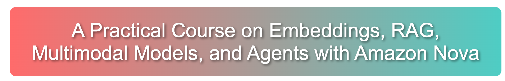

[](https://github.com/debnsuma/fcc-ai-engineering-aws/stargazers)
[](https://github.com/debnsuma/fcc-ai-engineering-aws/network/members)
[](https://github.com/debnsuma/fcc-ai-engineering-aws/watchers)
[](https://github.com/debnsuma?tab=followers)




Welcome to **A Practical Course on Embeddings, RAG, Multimodal Models, and Agents with Amazon Nova**. This repository offers an in-depth exploration into the realms of AI engineering, covering a spectrum of technologies from **text embeddings** and **Amazon Tian Text Embeddings** to **LangChain** integration with **Amazon Bedrock**. Dive into the complexities of **Multimodal LLMs** and **Amazon Nova**, along with **Retrieval Augmented Generation (RAG)**, and **Multimodal RAG** techniques using **Amazon Nova**. 

As the course progresses, you'll also engage in building a comprehensive end-to-end application utilizing **Amazon Bedrock Agents** and **Knowledge Bases**. This course demonstrates practical applications of these technologies, such as automating and optimizing the insurance claim process with AI. You'll learn how to leverage Bedrock-powered agents to assist in tasks like claim creation, document management, and data retrieval, significantly enhancing efficiency and decision-making capabilities in customer service operations. Join us to build transformative AI skills that integrate seamlessly with existing enterprise systems for real-world impact.

Also, if you have any questions or feedback, please feel free to open an issue or contact me over [LinkedIn](https://www.linkedin.com/in/suman-d/). 


## 🎯 Overview

This course dives deep into the world of AI engineering, leveraging the power of AWS to build sophisticated AI systems. With a strong focus on Multimodal Retrieval Augmented Generation (RAG), you'll learn to:

- Implement advanced RAG techniques using [LangChain](https://python.langchain.com/)
- Use different foundational models with [Amazon Bedrock](https://aws.amazon.com/bedrock/)
- Create powerful multimodal AI systems capable of processing both text and image data
- Explore cutting-edge RAG techniques for enhanced information retrieval and generation with [OpenSearch](https://aws.amazon.com/opensearch-service/)
- Implement practical Multimodal RAG applications using AWS services and tools, like Lambda, DynamoDB, and more
- Evaluate and optimize AI model performance for production environments
- Implement Multimodal RAG with Vision Language Models using Colpali and Amazon Nova

Our course emphasizes hands-on experience with Multimodal RAG, enabling you to build context-aware AI systems that can understand and process both textual and visual information effectively.

## 📚 Course Structure

| Module | Topic | Status | Description |
|--------|-------|--------|-------------|
| 1 | [Embeddings in NLP](01-embeddings) | ✅ | Master text embeddings and vector databases |
| 2 | [Amazon Tian Text Embeddings](01-embeddings/embeddings-with-bedrock.ipynb) | ✅ | Use Amazon Tian Text Embeddings for text/image embeddings |
| 3 | [Multimodal LLMs](02-multimodal-llm) | ✅ | Process text and image data with advanced LLMs |
| 4 | [Amazon Nova Multimodal Model](02-multimodal-llm/01_Amazon_Nova.ipynb) | ✅ | Text, Image and Video Understanding with Amazon Nova |
| 5 | [Multimodal RAG](03-multimodal-rag) | ✅ | Implement sophisticated retrieval systems with Amazon Nova and LangChain |
| 6 | [Agents with Knowledge Bases](04-knowledge-base-agents) | ✅ | Build an end-to-end application with Bedrock Agents and Knowledge Bases with Amazon Nova |
| 7 | [Multimodal RAG with Colpali](05-multimodal-rag-with-colpali) | ✅ | Implement sophisticated retrieval systems with Vision Language Models using Colpali and Amazon Nova |

## 🛠 Technologies/Tools Used

- [Amazon Web Services (AWS)](https://aws.amazon.com/): Cloud platform providing a wide range of AI and machine learning services
- [Amazon Bedrock](https://aws.amazon.com/bedrock/): Fully managed service for building generative AI applications
- [LangChain](https://python.langchain.com/): Framework for developing applications powered by language models
- [OpenSearch](https://aws.amazon.com/opensearch-service/): Search and analytics suite for building scalable solutions
- [Unstructured](https://unstructured.io/): A platform that provides tools and APIs to preprocess and structure unstructured data like documents, images, and text for easier analysis and machine learning applications.
- [Amazon Bedrock](https://aws.amazon.com/bedrock/): Fully managed service that offers a choice of high-performing foundation models
- [Jupyter Notebooks](https://jupyter.org/): Interactive computing environment for creating and sharing documents with live code

## 🎓 Learning Objectives

By the end of this course, you will be able to:

1. Understand the basics of Embeddings and how to use them with Amazon Bedrock
2. How to use Amazon Titan Text Embeddings for text/image embeddings
3. Understand internals about Multimodal LLMs, CLIP, and BLIP-2
4. How to use Multimodal LLMs with Amazon Bedrock
5. How to use Amazon Nova Multimodal Model for Text, Image and Video Understanding
6. Basics of RAG (Retrieval Augmented Generation)
7. How to use Multimodal RAG with Amazon Nova and LangChain
8. How to use Knowledge Base with Agents with Amazon Bedrock
9. How to use Amazon Bedrock Agents for building end-to-end applications

## ⚡ Quick Start

1. **Clone & Setup**
   ```bash
   git clone https://github.com/debnsuma/fcc-ai-engineering-aws.git

   cd fcc-ai-engineering-aws
   ```

2. **Install Dependencies**
   ```bash
   pip install -r requirements.txt
   ```

3. **Run the Notebooks**
   ```bash
   jupyter notebook
   ```


## 📝 License

This repository is open-sourced under the MIT License - see the [LICENSE](LICENSE) file for details.

